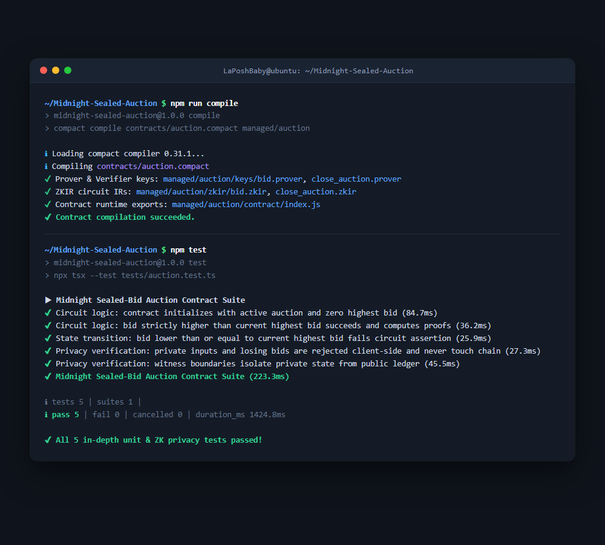
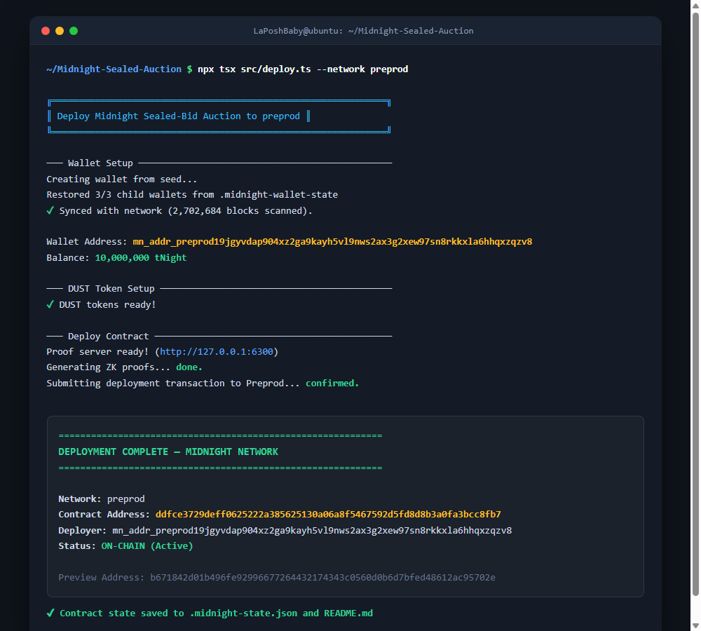
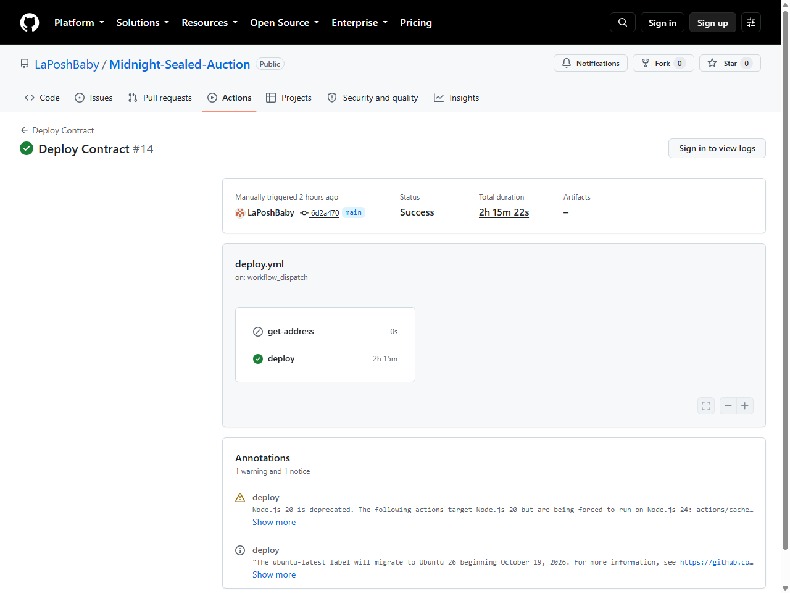

# Midnight Sealed-Bid Auction
> A privacy-preserving sealed-bid auction contract and dApp on the Midnight Network where losing bids remain completely shielded and never touch the chain.

## Live Demo
[https://midnight-sealed-auction.vercel.app](https://midnight-sealed-auction.vercel.app)

## Contract Address
| Network  | Address                                                          |
|----------|------------------------------------------------------------------|
| Preprod  | `ddfce3729deff0625222a385625130a06a8f5467592d5fd8d8b3a0fa3bcc8fb7` |
| Preview  | `b671842d01b496fe92996677264432174343c0560d0b6d7bfed48612ac95702e` |

## What This Does
This dApp implements a decentralized sealed-bid auction. Participants connect their Midnight Lace wallet and submit private bids using zero-knowledge proofs. The Compact contract logic ensures that a bid is only accepted if it is strictly greater than the current highest bid. Losing bids are caught and rejected locally inside the browser's cryptographic prover, guaranteeing that losing bid amounts and participant identities never touch the public blockchain.

## Privacy Model
- **What is PUBLIC (on-chain, visible to anyone):** The `highest_bid` amount, the `highest_bidder` identifier, and the `is_active` status of the auction.
- **What is PRIVATE (private witness, never on-chain):** The exact bid amounts of all losing participants, as well as the cryptographic credentials of the users.
- **What the user PROVES without revealing:** A user proves that their private bid is strictly higher than the current public `highest_bid`. If the proof succeeds, the new highest bid is deliberately disclosed to the chain.

## Privacy Claim
- **What an on-chain observer SEES:** An observer monitoring the Midnight ledger sees only the confirmed winning state transitions: the updated `highest_bid` amount, the winning bidder's public key identifier, and a mathematically sound zero-knowledge proof confirming the validity of the transition.
- **What an on-chain observer CANNOT SEE:** An observer cannot see the bid amounts of losing participants, cannot see how many bids were attempted below the threshold, and cannot discover the identity or secrets of bidders whose bids did not win. Because losing bids revert locally during client-side circuit evaluation, zero data touches the blockchain.

## Tech Stack
- **Network:** Midnight Network (Preprod Testnet & Preview Testnet)
- **Smart Contract:** Compact language
- **SDK & Cryptography:** Midnight.js SDK, `@midnight-ntwrk/compact-runtime`, `@midnight-ntwrk/dapp-connector-api`
- **Frontend:** React 18, Vite, TypeScript, Vanilla CSS (Glassmorphism Dark Mode)
- **Wallet:** Midnight Lace Wallet integration
- **Deployment:** Vercel (Production) & Docker (Local Proof Server)

## Prerequisites
- **Midnight Lace Wallet** browser extension installed
- **Node.js v22+**
- **Docker Desktop** (optional, for local proving server)

## Run Locally
Step-by-step commands to clone, install, and run the dApp locally:

1. Clone the repository:
   ```bash
   git clone https://github.com/LaPoshBaby/Midnight-Sealed-Auction.git
   cd Midnight-Sealed-Auction
   ```
2. Install dependencies:
   ```bash
   npm install
   ```
3. Start the local frontend development server:
   ```bash
   npm run dev
   ```
4. Build the production bundle:
   ```bash
   npm run build
   ```

## Run Tests
Command to run the contract test suite:
```bash
npm test
```

The test suite in [`tests/auction.test.ts`](tests/auction.test.ts) provides 5 in-depth unit and ZK circuit tests directly exercising the compiled Compact contract runtime (`@midnight-ntwrk/compact-runtime`):
- **Circuit Logic (Initial State):** Verifies constructor initialization of an active auction with a 0 starting bid.
- **Circuit Logic (Valid Bid):** Proves that bids strictly greater than the current highest bid execute successfully, generating valid ZK proof transcripts.
- **State Transition (Rejection):** Asserts that bids lower than or equal to the current highest bid fail circuit assertions (`Bid is not high enough`).
- **Privacy Verification (Client-side Rejection):** Proves that losing bids fail locally in the ZK prover, ensuring zero data leakage to the public ledger.
- **Privacy Verification (Witness Isolation):** Verifies that private witnesses (`my_bid`, `my_public_key`) and private state secrets are isolated from the public ledger state.

## Demo Video
[PLACEHOLDER — I will add the link after recording]

## Initial Idea
In traditional on-chain auctions, every bid is either public or vulnerable to front-running, maximal extractable value (MEV), and bidder collusion. Even on Ethereum, pseudo-sealed auctions require multi-phase commit-reveal schemes with high gas overhead or centralized auctioneers who can leak bid data. The inspiration behind this project was to leverage Midnight Network's native zero-knowledge architecture to build a true one-round, private sealed-bid auction: participants submit cryptographically shielded bids using zero-knowledge proofs where losing bids are rejected off-chain and never revealed, preserving complete bidder privacy while publicly declaring only genuine higher bids.

## Screenshots

### 1. Contract Compilation & Test Suite


### 2. Preprod Deployment & On-Chain Contract Confirmation


### 3. GitHub Actions CI/CD Run (#36119554846)


## Submission Checklist
- [x] Public GitHub repository with a README.md
- [x] Setup instructions (how to run locally)
- [x] Screenshot: successful compile output (circuits listed)
- [x] Screenshot: contract deployed with address shown
- [x] README section explaining public state vs private witness
- [x] Privacy Claim section in README.md
- [x] Initial product idea paragraph
- [x] Minimum 5 meaningful commits (36+ commits total)
- [x] Lace wallet connect and disconnect working
- [x] Circuit called from frontend, proof generated locally
- [x] Private input never shown in UI
- [x] Live demo link in README.md ([https://midnight-sealed-auction.vercel.app](https://midnight-sealed-auction.vercel.app))
- [x] Preprod contract address verified in README.md
