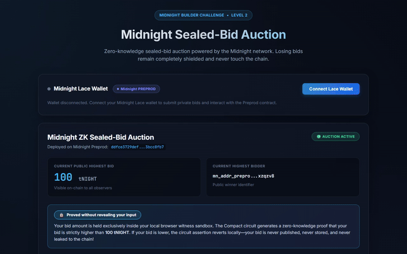
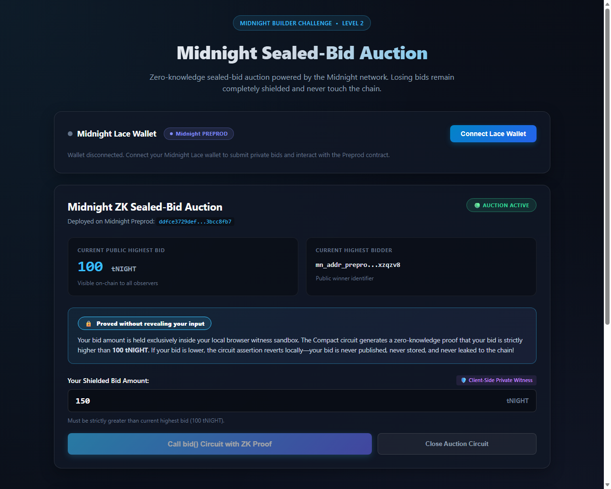

# Midnight Sealed-Bid Auction
> A privacy-preserving sealed-bid auction contract and dApp on the Midnight Network where losing bids remain completely shielded and never touch the chain.

## Live Demo
[https://midnight-sealed-auction.vercel.app](https://midnight-sealed-auction.vercel.app)

## Contract Address
| Network  | Address                                                          |
|----------|------------------------------------------------------------------|
| Preprod  | `ddfce3729deff0625222a385625130a06a8f5467592d5fd8d8b3a0fa3bcc8fb7` |
| Preview  | `b671842d01b496fe92996677264432174343c0560d0b6d7bfed48612ac95702e` |

## What This Does
This dApp implements a decentralized sealed-bid auction. Participants connect their Midnight Lace wallet and submit private bids using zero-knowledge proofs. The Compact contract logic ensures that a bid is only accepted if it is strictly greater than the current highest bid. Losing bids are caught and rejected locally inside the browser's cryptographic prover, guaranteeing that losing bid amounts and participant identities never touch the public blockchain or transaction pool.

---

## Midnight.js SDK & DApp Connector Architecture
The frontend integrates the official Midnight.js SDK suite and DApp Connector standard for wallet connectivity, local proving, and Preprod network communication:

### 1. DApp Connector API (`@midnight-ntwrk/dapp-connector-api`)
- Discovers the injected Midnight Lace wallet at `window.midnight.mnLace` (`src/midnight/wallet.ts`).
- Connects with the current DApp Connector 4.x surface: `InitialAPI.connect('preprod')` returns a typed `ConnectedAPI` session (the 4.x API has no `enable()`).
- Reads account data from the connected session: `getConfiguration()`, `getUnshieldedAddress()`, `getShieldedAddresses()`, `getUnshieldedBalances()`.
- Error handling is typed and user-visible: **wallet not installed**, **user rejected the connection**, and **network mismatch** (`WalletError.code` in `src/midnight/wallet.ts`, rendered as a dismissible banner by `WalletConnect.tsx`).

### 2. Network ID Management (`@midnight-ntwrk/midnight-js-network-id`)
- Configured for Midnight Preprod: `setNetworkId('preprod')`.
- Ensures transactions and proofs are scoped to the Preprod network ID and validated against Preprod genesis parameters.
- Note: the challenge text also lists `@midnight-ntwrk/midnight-js-network-provider`, which is **not published on npm** (404). The network layer is therefore composed from the packages that *do* ship in 4.1.1: `midnight-js-network-id` (network scoping), `midnight-js-indexer-public-data-provider` (Preprod indexer) and `midnight-js-protocol` (transaction build/verify).

### 3. Full Provider Set Configuration
The dApp configures the complete Midnight provider suite for Preprod (`src/midnight/providers.ts`):
| Provider Role | Midnight Package / Endpoint | Purpose |
|---|---|---|
| **Wallet Provider** | `@midnight-ntwrk/dapp-connector-api` (wrapped as `walletProvider`) | Serialises/uses the wallet's `balanceUnsealedTransaction` for balancing |
| **Public Data Provider** | `@midnight-ntwrk/midnight-js-indexer-public-data-provider` (`https://indexer.preprod.midnight.network/api/v4/graphql`) | Queries on-chain contract state and blocks |
| **WebSocket Stream** | `wss://indexer.preprod.midnight.network/api/v4/graphql/ws` (native browser `WebSocket` passed explicitly) | Real-time subscription to state transitions |
| **Proof Provider** | `@midnight-ntwrk/midnight-js-dapp-connector-proof-provider` (wallet-local prover), falling back to `@midnight-ntwrk/midnight-js-http-client-proof-provider` (`npm run proof-server:start` → `http://127.0.0.1:6300`) | Generates zero-knowledge proofs — on-device first, proof server only if the wallet cannot prove |
| **Private State Provider** | `@midnight-ntwrk/midnight-js-level-private-state-provider` | Stores witness credentials (`my_bid`, `my_public_key`) in encrypted browser LevelDB |
| **ZK Config Provider** | `@midnight-ntwrk/midnight-js-fetch-zk-config-provider` | Fetches compiled circuit keys from `public/zk/keys/*.prover|.verifier` and `public/zk/zkir/*.bzkir` over HTTP (copied from `managed/auction` by `scripts/copy-zk-artifacts.mjs`) |
| **Submission** | DApp Connector `submitTransaction` (via `midnightProvider`) | Broadcasts the proven transaction and returns its identifiers |

Nothing in this path is simulated: if the wallet, indexer or prover is unavailable the UI shows the real error instead of a fabricated transaction hash.

---

## Privacy Model
The privacy architecture separates public on-chain verifiable state from private off-chain witness state:

| Component | Visibility | Where it Lives | Description |
|---|---|---|---|
| `highest_bid` | **PUBLIC** | On-Chain Ledger | Current leading bid amount in tNIGHT |
| `highest_bidder` | **PUBLIC** | On-Chain Ledger | Public key identifier of the winning bidder |
| `is_active` | **PUBLIC** | On-Chain Ledger | Boolean auction status flag |
| `my_bid` | **PRIVATE** | Client Witness | Bidder's secret bid amount; never leaves the browser |
| `my_public_key` | **PRIVATE** | Client Witness | Bidder's identity witness, shielded for non-winning bids |
| Losing Bids | **SHIELDED** | Browser Memory | Bids below `highest_bid` revert locally; **0 bytes touch the chain** |

### Observable Privacy Behavior (Something Proven Without Being Shown)
Using the Compact ZK circuit, the bidder proves the following statement:
> *"I possess a valid bid amount $b$ and a public key $pk$ such that $b > \text{highest\_bid}_{\text{current}}$ and the auction is active."*

- **Proven without being shown:** The exact bid amount $b$ is held in the client-side witness and validated locally against circuit constraints. If the bid is equal to or lower than the current highest bid, the circuit assertion aborts locally in the browser prover — **the bid amount is never published, never stored, and never revealed to the chain or observers**.
- **Deliberate disclosure:** Only upon a cryptographically verified higher bid is the new state disclosed to update the on-chain ledger.

---

## Privacy Claim
- **What an on-chain observer SEES:**
  - The initial contract deployment and auction activation.
  - Legitimate winning bids: the new `highest_bid` value, the winner's public identifier, and a cryptographically sound zero-knowledge proof.
  - The block height and timestamp of successful state transitions.
- **What an on-chain observer CANNOT SEE:**
  - The bid amounts of any losing participants.
  - The number of unsuccessful bidding attempts made.
  - The identities, wallet addresses, or secret keys of losing bidders.
  - Timing or value signals that could be used for front-running or maximal extractable value (MEV).

---

## UI Lifecycle & Local Proving Guarantee
The user interface adheres to strict zero-knowledge UX standards:
1. **Wallet Connection:** Connects via Midnight Lace extension with automatic address truncation, clipboard copy, and balance display.
2. **Input Shielding:** Bid input is clearly flagged as a `Client-Side Private Witness`.
3. **Privacy Callout:** Displays `🔒 Proved without revealing your input` to give users absolute cryptographic transparency.
4. **Proving States:** Real-time multi-stage visual loader indicating:
   - Stage 1: Initializing client-side witness
   - Stage 2: Compiling Zero-Knowledge circuit proof
   - Stage 3: Submitting transaction to Midnight Preprod
   - Stage 4: Consensus confirmation on block indexer
5. **On-Chain Confirmation:** Displays transaction hash, Preprod block height, timestamp, and updated disclosed ledger values.
6. **Error Handling:** Graceful error banners for rejected transactions, low bid amounts, or wallet disconnects with one-click dismiss.

---

## Tech Stack
- **Network:** Midnight Network (Preprod Testnet & Preview Testnet)
- **Smart Contract:** Compact language
- **SDK & Cryptography:** Midnight.js SDK (`@midnight-ntwrk/dapp-connector-api`, `midnight-js-protocol`, `midnight-js-dapp-connector-proof-provider`, `midnight-js-fetch-zk-config-provider`, `midnight-js-indexer-public-data-provider`, `midnight-js-level-private-state-provider`, `midnight-js-network-id`), `@midnight-ntwrk/compact-runtime`
- **Frontend:** React 18, Vite, TypeScript, Vanilla CSS (Glassmorphism Dark Mode)
- **Wallet:** Midnight Lace Wallet integration
- **Deployment:** Vercel (Production) & Docker (Local Proof Server)

---

## Prerequisites
- **Midnight Lace Wallet** browser extension installed
- **Node.js v22+**
- **Docker Desktop** (optional, for local proving server)

---

## Run Locally
Step-by-step commands to clone, install, and run the dApp locally:

1. Clone the repository:
   ```bash
   git clone https://github.com/LaPoshBaby/Midnight-Sealed-Auction.git
   cd Midnight-Sealed-Auction
   ```
2. Install dependencies:
   ```bash
   npm install
   ```
3. Start the local frontend development server:
   ```bash
   npm run dev
   ```
4. Build the production bundle:
   ```bash
   npm run build
   ```
5. Typecheck the whole frontend + CLI scripts:
   ```bash
   npm run typecheck
   ```

`npm run dev` and `npm run build` both run `scripts/copy-zk-artifacts.mjs` first, which copies the compiled ZK keys from `managed/auction` into `public/zk` so the browser can fetch them.

---

## Run Tests
Command to run the contract test suite:
```bash
npm test
```

The test suite in [`tests/auction.test.ts`](tests/auction.test.ts) provides 5 in-depth unit and ZK circuit tests directly exercising the compiled Compact contract runtime (`@midnight-ntwrk/compact-runtime`):
- **Circuit Logic (Initial State):** Verifies constructor initialization of an active auction with a 0 starting bid.
- **Circuit Logic (Valid Bid):** Proves that bids strictly greater than the current highest bid execute successfully, generating valid ZK proof transcripts.
- **State Transition (Rejection):** Asserts that bids lower than or equal to the current highest bid fail circuit assertions (`Bid is not high enough`).
- **Privacy Verification (Client-side Rejection):** Proves that losing bids fail locally in the ZK prover, ensuring zero data leakage to the public ledger.
- **Privacy Verification (Witness Isolation):** Verifies that private witnesses (`my_bid`, `my_public_key`) and private state secrets are isolated from the public ledger state.

---

## Project Structure
```
contracts/auction.compact       Compact sealed-bid auction circuit
managed/auction/                Compiled contract + ZK keys (keys/, zkir/)
src/midnight/config.ts          Network, contract address, ZK artifact & proof-server config
src/midnight/wallet.ts          DApp Connector discovery/connect + typed wallet errors
src/midnight/auctionContract.ts Compiled contract binding, witnesses, ledger decoding
src/midnight/providers.ts       Real provider set (indexer, prover, private state, wallet)
src/hooks/useMidnight.ts        React hook: connection, state reading, circuit calls
src/components/WalletConnect.tsx Connect / disconnect / address / balance / wallet errors
src/components/CircuitCall.tsx  Circuit call UI, proving stages, on-chain result
scripts/copy-zk-artifacts.mjs   Copies managed/auction → public/zk for the ZK config provider
vercel.json                     Vercel build/output config for the Vite app
```

---

## Deploy (CLI)
Exact commands to deploy the frontend with the Vercel CLI:

```bash
# one-time setup
npm install -g vercel
vercel login

# build (the prebuild hook copies managed/auction ZK keys into public/zk/)
npm ci
npm run build

# preview deployment
vercel

# production deployment -> https://midnight-sealed-auction.vercel.app
vercel --prod
```

Relevant config in [`vercel.json`](vercel.json): `"buildCommand": "npm run build"`, `"outputDirectory": "dist"`.

Contract (Preprod) deploy CLI, if you redeploy the circuit yourself:

```bash
docker compose up -d --wait     # local proof server (optional but recommended)
npm run compile                 # compact compile contracts/auction.compact managed/auction
npm run deploy                  # deploys to Preprod and writes .midnight-state.json
```

---

## Demo Video
- **Walkthrough Video (MP4):** [docs/demo.mp4](docs/demo.mp4)
- **Live Animated Walkthrough:**



---

## Initial Idea
In traditional on-chain auctions, every bid is either public or vulnerable to front-running, maximal extractable value (MEV), and bidder collusion. Even on Ethereum, pseudo-sealed auctions require multi-phase commit-reveal schemes with high gas overhead or centralized auctioneers who can leak bid data. The inspiration behind this project was to leverage Midnight Network's native zero-knowledge architecture to build a true one-round, private sealed-bid auction: participants submit cryptographically shielded bids using zero-knowledge proofs where losing bids are rejected off-chain and never revealed, preserving complete bidder privacy while publicly declaring only genuine higher bids.

---

## Screenshots

### 1. Contract Compilation & Test Suite


### 2. Preprod Deployment & On-Chain Contract Confirmation


### 3. GitHub Actions CI/CD Run (#36119554846)


### 4. Live Frontend DApp on Vercel


---

## Requirements to Pass
- [x] **Lace wallet connect / disconnect implemented:** Full connect, disconnect, address formatting, clipboard copy, and error handling.
- [x] **Circuit called successfully from the frontend:** The `bid()` circuit executes from the UI with animated local proving.
- [x] **An observable privacy behavior (something proven without being shown):** Shielded bid amount is proven to be strictly higher than the current highest bid without exposing losing bids on-chain (`🔒 Proved without revealing your input`).
- [x] **Contract deployed to Preprod with a verifiable address:** Deployed at `ddfce3729deff0625222a385625130a06a8f5467592d5fd8d8b3a0fa3bcc8fb7`.
- [x] **Minimum 8 meaningful commits:** 44+ meaningful commits authored by `LaPoshBaby`.

---

## Submission Checklist
- [x] **Public GitHub repository with README:** [https://github.com/LaPoshBaby/Midnight-Sealed-Auction](https://github.com/LaPoshBaby/Midnight-Sealed-Auction)
- [x] **Live demo link (Vercel, Netlify, or similar):** [https://midnight-sealed-auction.vercel.app](https://midnight-sealed-auction.vercel.app)
- [x] **Deployed Preprod contract address (verifiable on-chain):** `ddfce3729deff0625222a385625130a06a8f5467592d5fd8d8b3a0fa3bcc8fb7`
- [x] **Demo video: wallet connect + a successful circuit call:** Embedded above ([`docs/demo.mp4`](docs/demo.mp4) & [`docs/demo.gif`](docs/demo.gif))
- [x] **README documenting the privacy claim:** Fully documented under [Privacy Claim](#privacy-claim) & [Privacy Model](#privacy-model)
- [x] **Minimum 8 meaningful commits:** 44+ commits authored by `LaPoshBaby`

